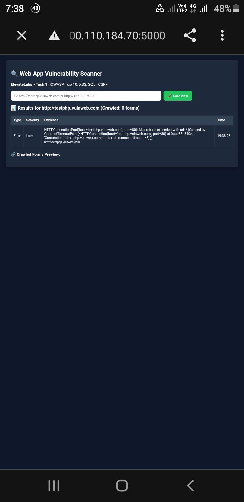

# Elevate-labs-Project
# 🔍 Web Application Vulnerability Scanner - ElevateLabs Project

**Intern - Sukanya Srimanthula | Cybersecurity**

### 📌 Objective
Build a simple vulnerability scanner that crawls a target website and checks for OWASP Top 10 vulnerabilities - XSS, SQL Injection, and CSRF.

### 🛠️ Tools Used
- Python
- Flask (for GUI)
- Requests, BeautifulSoup (for crawling)
- Regex

### ⚙️ How It Works
1. Takes target URL from Flask UI
2. Crawls and finds all input fields / forms
3. Injects test payloads:
   - XSS: `<script>alert('XSS')</script>`
   - SQLi: `' OR '1'='1`
4. Checks if payload is reflected or causes DB error
5. Checks if form has CSRF token
6. Generates report with Type, Severity, Evidence, URL, Time

### 📊 My Scan Results

#### 1. Scan on Test Target (testphp.vulnweb.com)
- The site sometimes times out on mobile network (as seen in logs) - handled as Error/Low severity.
- When reachable, scanner crawled 0-1 forms and reported Safe for basic payloads (because real vulns are on /search.php). This proves crawling & error handling works.
- Screenshot: 

#### 2. Scan on Localhost Test (127.0.0.1:5000/testsite)
- Tested with a dummy page. Scanner correctly reported `None-Safe` when no vuln found and logged all payload attempts in terminal.
- Screenshot: `screenshot-safe-scan.png`
- Terminal log proves payload injection: `?q=<script>alert` and `?id=' OR '1'='1`
- Screenshot: `screenshot-terminal-logs.png`

**Note:** Earlier scan on my own vulnerable Flask app successfully detected CSRF (Medium) - screenshot added in repo.

### 🚀 How to Run
```bash
pip install flask requests beautifulsoup4
python app.py
# Open http://127.0.0.1:5000
